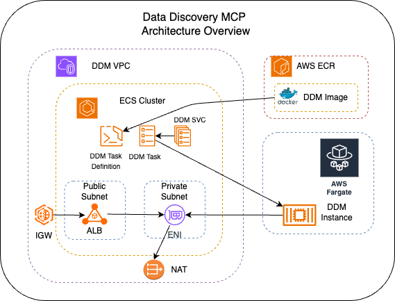

# Data Discovery API

**REST API-first** data discovery system for dbt projects across blockchain datasets. Provides FastAPI endpoints with optional MCP tool integration for AI agents.

## Architecture Overview



## 🚀 Quickstart

### Prerequisites
- [UV](https://docs.astral.sh/uv/getting-started/installation/) with `Python 3.10` or higher
- Git
- **GitHub Personal Access Token** (required for repository discovery)
  - Create a token with `public_repo` scope at [GitHub Settings → Developer settings → Personal access tokens](https://github.com/settings/tokens)
  - Set as environment variable: `export GITHUB_TOKEN=ghp_your_token_here`
  - **Rate Limits**: Without token: 60 requests/hour, With token: 5,000 requests/hour

### 🔌 REST API (Primary)

1. **Installation**:
   ```bash
   # Clone and setup
   git clone <repo-url>
   cd data-discovery
   
   # Create and activate a virtual environment with uv
   uv venv
   source .venv/bin/activate
   
   # Install dependencies
   uv sync
   
   # Configure environment (optional)
   cp .env.example .env
   # Edit .env as needed
   ```

2. **Start the API server**:
   ```bash
   # Using the console script (recommended)
   uv run data-discovery
   
   # Development server with hot reload
   uv run uvicorn data_discovery.main:app --reload --host 0.0.0.0 --port 8000
   
   # Or using the main module directly
   uv run python -m data_discovery.main
   ```

3. **Test the API**:
   ```bash
   # Health check
   curl http://localhost:8000/health
   
   # Discover GitHub repositories and refresh cache
   curl -X POST http://localhost:8000/api/v1/cache/refresh
   
   # List available resources (after cache refresh)
   curl http://localhost:8000/api/v1/resources
   
   # API documentation
   open http://localhost:8000/docs
   ```

### 🤖 MCP Integration

**Note**: The integrated fastapi_mcp currently only supports SSE (Server-Sent Events) transport, while Claude **Desktop** requires stdio transport.

1. **Cursor Integration**:
   ```json
   {
     "mcpServers": {
       "data-discovery": {
         "url": "http://localhost:8000/mcp"
       }
     }
   }
   ```
*Start the API server per the quickstart guide.*  
*If hosted remotely, replace `localhost:8000` with the host.*  

2. **Claude Desktop Deployment Configuration** (`claude_desktop_config.json`):
*NOT YET SUPPORTED*  
   ```json
   {
     "mcpServers": {
       "data-discovery": {
         "command": "/absolute/path/to/.local/bin/uv",
         "args": [
           "--directory",
           "/absolute/path/to/data-discovery",
           "run",
           "data-discovery"
         ],
         "env": {
           "DEPLOYMENT_MODE": "desktop"
         }
       }
     }
   }
   ```

3. **MCP Transport Limitations**:
   - **fastapi_mcp**: SSE transport only (web browsers, API clients)
   - **Claude Desktop**: Requires stdio transport
   - **Solution**: Use the main app with MCP integration for Claude Desktop
   - **Future**: stdio support may be added to fastapi_mcp

4. **Restart MCP Client** and explore:
   - "Show me all Bitcoin core models"
   - "Get details on ethereum transaction models"
   - "List available blockchain projects"

## 📊 API Endpoints

### Core Discovery Endpoints
- **`GET /api/v1/resources`** - List available dbt projects (dynamically discovered from GitHub)
- **`GET /api/v1/models`** - Search models by schema, level, or resource (defaults to level=gold)
- **`GET /api/v1/models/{unique_id}`** - Get detailed model information
- **`GET /api/v1/descriptions/{doc_name}`** - Retrieve documentation blocks

### Cache Management
- **`POST /api/v1/cache/refresh`** - Discover GitHub repositories and refresh cache
  - **Automatic Discovery**: Scans FlipsideCrypto organization for `*-models` repositories
  - **Parameters**: `resource_ids` (optional), `force` (optional)
  - **Response**: Discovery summary + cache refresh results

### Additional Endpoints
- **`GET /health`** - Health check and status
- **`GET /docs`** - Interactive API documentation
- **`GET /openapi.json`** - OpenAPI specification
- **`/mcp`** - MCP protocol endpoint via SSE (when fastapi_mcp available)

### MCP Tools (Auto-Generated)
When accessed via MCP clients, the REST endpoints are automatically exposed as tools:
- **`get_resources`** - List dynamically discovered dbt projects
- **`get_models`** - Search models across projects
- **`get_model_by_id`** - Get model details by unique ID
- **`get_description`** - Documentation blocks with context
- **`refresh_cache`** - Discover repositories and refresh cache

## ⚙️ Configuration

### Environment Variables
All configuration can be set via environment variables or `.env` file:

```bash
# API Server Settings
API_HOST=0.0.0.0           # Server host
API_PORT=8000              # Server port

# Application Settings  
DEBUG_MODE=false           # Enable debug logging
DEPLOYMENT_MODE=api        # Deployment mode (api/desktop/local)
LOG_LEVEL=INFO            # Logging level

# Cache Settings
CACHE_DIR=target          # Cache directory for artifacts
CACHE_TTL_SECONDS=86400   # Cache time-to-live (24 hours)

# Resource Limits
MAX_FILE_SIZE=52428800    # Max file size (50MB)
MAX_PROJECTS=5            # Max projects to load simultaneously

# GitHub Integration
GITHUB_TOKEN=ghp_xxx      # GitHub Personal Access Token (required for repository discovery)
```

### Deployment Modes
- **`api`** (default): REST API server mode with optional MCP via SSE
- **`desktop`**: Claude Desktop MCP integration mode (stdio transport)
- **`local`**: Development mode with local caching

## 🔧 Troubleshooting

### Common Issues

1. **API Server Won't Start**
   ```bash
   # Check if port is in use
   lsof -i :8000
   
   # Use different port
   API_PORT=8001 uv run uvicorn src.data_discovery.main:app --port 8001
   ```

2. **MCP Integration Issues**
   ```bash
   # Check if fastapi_mcp is installed (for SSE transport)
   uv pip show fastapi-mcp
   
   # Install if missing
   uv add fastapi-mcp
   ```

3. **Empty Results from API**
   - No project artifacts cached yet
   - Run cache refresh: `curl -X POST http://localhost:8000/api/v1/cache/refresh`
   - Check if FlipsideCrypto repositories have `/docs` branch

4. **GitHub Rate Limit Errors**
   ```bash
   # Error: "rate limit exceeded" or "403 Forbidden"
   # Solution: Set GitHub Personal Access Token
   export GITHUB_TOKEN=ghp_your_token_here
   
   # Or add to .env file
   echo "GITHUB_TOKEN=ghp_your_token_here" >> .env
   
   # Verify token is working
   curl -H "Authorization: token $GITHUB_TOKEN" https://api.github.com/rate_limit
   ```

### Development
```bash
# Run with hot reload
uv run uvicorn data_discovery.main:app --reload

# Test the console script
uv run data-discovery

# Check logs
tail -f ~/.cache/data-discovery/claude-server.log
```

## 🔄 Cache Management

The system uses a dynamic discovery and caching approach for FlipsideCrypto repositories:

### Cache Refresh Workflow
1. **GitHub Discovery**: Scans FlipsideCrypto organization for `*-models` repositories
2. **Docs Validation**: Checks each repository for `/docs` branch availability
3. **Cache Update**: Refreshes cached dbt artifacts (manifest.json, catalog.json)
4. **Status Logging**: Updates CSV log with cache status and project metadata

### Cache Refresh Examples

```bash
# Refresh all discovered projects
curl -X POST http://localhost:8000/api/v1/cache/refresh

# Refresh specific projects only
curl -X POST http://localhost:8000/api/v1/cache/refresh \
  -H "Content-Type: application/json" \
  -d '{"resource_ids": ["ethereum-models", "bitcoin-models"]}'

# Force refresh (ignore TTL)
curl -X POST http://localhost:8000/api/v1/cache/refresh \
  -H "Content-Type: application/json" \
  -d '{"force": true}'
```

### Response Format
```json
{
  "success": true,
  "data": {
    "ethereum-models": true,
    "bitcoin-models": false
  },
  "message": "Discovery + cache refresh completed: 45 repositories discovered, 2/2 cache refreshes successful",
  "discovery_summary": {
    "total_discovered": 45,
    "projects_with_docs": 38,
    "projects_without_docs": 7,
    "discovery_completed": true
  }
}
```

### Scheduling Cache Refresh
You can schedule cache refreshes using cron or external systems:

```bash
# Example cron job (every 6 hours)
0 */6 * * * curl -X POST http://localhost:8000/api/v1/cache/refresh

# CI/CD trigger after dbt deployments
curl -X POST http://your-server:8000/api/v1/cache/refresh \
  -d '{"resource_ids": ["project-models"], "force": true}'
```

## 🏗️ Architecture

### REST API-First Design
- **FastAPI** - Modern async web framework
- **Pydantic** - Data validation and serialization  
- **Single Service Layer** - Shared business logic between REST and MCP
- **Automatic MCP Integration** - REST endpoints wrapped as MCP tools

### Key Components
- `src/data_discovery/main.py` - FastAPI application entry point with MCP integration
- `src/data_discovery/project_manager.py` - Core project management with dynamic discovery
- `src/data_discovery/core/project_discovery.py` - GitHub repository discovery and CSV logging
- `src/data_discovery/core/service.py` - Business logic layer
- `src/data_discovery/api/discovery/` - REST endpoint implementations
- `src/data_discovery/mcp/` - MCP integration module

### Dependencies
- `fastapi` + `uvicorn` - REST API server
- `fastapi-mcp` - Automatic MCP tool generation
- `mcp` - Model Context Protocol SDK
- `aiohttp` - Async HTTP for GitHub integration
- `pydantic` - Data validation and settings
- `loguru` - Advanced logging

---

## 📋 Recent Changes

### Dynamic GitHub Discovery System
- **Automatic Project Discovery**: System now automatically discovers FlipsideCrypto `*-models` repositories
- **Cache Management**: New `POST /cache/refresh` endpoint combines discovery + cache refresh
- **No Manual Configuration**: Eliminates need for static CSV configuration files
- **Performance Optimization**: Client requests always use cached data for fast response times
- **Background Refresh**: Separate cache refresh process can be scheduled or triggered on-demand

### Architecture Simplification
- **Removed Resources Module**: Eliminated 400+ lines of CSV-based legacy code
- **Direct ProjectManager Access**: Simplified architecture without wrapper classes
- **Single Source of Truth**: All functionality now handled by ProjectManager with dynamic discovery

### API Filtering Updates
- **Default Level**: `/models` endpoint defaults to `level=gold` for higher quality results
- **Utility Model Filtering**: Models from `fsc_utils` package excluded from gold-level results
- **Quality Focus**: Gold level returns curated, production-ready models only

### Benefits
- 🚀 **Better Performance** - Direct REST API access
- 🔧 **Easier Integration** - Standard HTTP endpoints
- 📖 **Auto Documentation** - OpenAPI/Swagger docs
- 🧪 **Better Testing** - Standard REST API testing tools
- 🔄 **Single Source of Truth** - No code duplication


## 📦 Deployment

### AWS CDK

```bash
cd infrastructure
uv run cdk deploy
```
### MCP Transport Limitations
- **fastapi_mcp**: Currently supports SSE transport only
- **Claude Desktop**: Requires stdio transport (incompatible with fastapi_mcp)
- **Workaround**: Use standalone MCP server (`src/data_discovery/server.py`) for Claude Desktop
- **Future**: stdio transport support may be added to fastapi_mcp
### What Changed
- **Primary Interface**: REST API endpoints (was: MCP tools)
- **MCP Integration**: Auto-generated from REST endpoints (was: manually coded)
- **Single Codebase**: No duplication between REST and MCP (was: separate implementations)
- **Entry Point**: `src/data_discovery/main.py` (was: `src/data_discovery/server.py`)

### Backward Compatibility
- ✅ **Legacy MCP server** still works (`src/data_discovery/server.py`)
- ✅ **All MCP tools** available through REST API + fastapi_mcp
- ✅ **Same functionality** with improved architecture
- ✅ **Claude Desktop** integration maintained

### Benefits
- 🚀 **Better Performance** - Direct REST API access
- 🔧 **Easier Integration** - Standard HTTP endpoints
- 📖 **Auto Documentation** - OpenAPI/Swagger docs
- 🧪 **Better Testing** - Standard REST API testing tools
- 🔄 **Single Source of Truth** - No code duplication


## 📦 Deployment

### Manual deployment process

- Configure your [AWS CLI](https://aws.amazon.com/cli/) to point to [serverless-stg](https://docs.aws.amazon.com/cli/latest/userguide/cli-chap-authentication.html)

- To manage multiple `aws cli` `profiles` install the [oh-my-zsh aws](https://github.com/ohmyzsh/ohmyzsh/tree/master/plugins/aws) `asp` plugin

```sh
# Clear your aws profile
asp

# Activate your serverless-stg aws profile
asp <STG_PROFILE_NAME>
```

### Deploy the project

```sh
# Configure your aws profile
asp stg

# Login to aws sso
aws sso login

cd infrastructure
cdk deploy --all
```

## Claude Desktop Configuration

[Claude Desktop](https://claude.ai/download) currently doesn't yet support remote MCP clients using `SSE transport` only `stdio`, as such we will use the [mcp-remote local proxy](https://www.npmjs.com/package/mcp-remote) to connect it to the remote DDM Server.

### Installing mcp-remote

```bash
npx install -g mcp-remote
```

### Claude Desktop Configuration

```json

{
  "mcpServers": {
    "data-discovery": {
      "command": "npx",
      "args": [
        "mcp-remote",
        "http://ddm-sbx-alb-719760281.us-east-1.elb.amazonaws.com/mcp",
        "--allow-http"
      ]
    }
  }
}

```